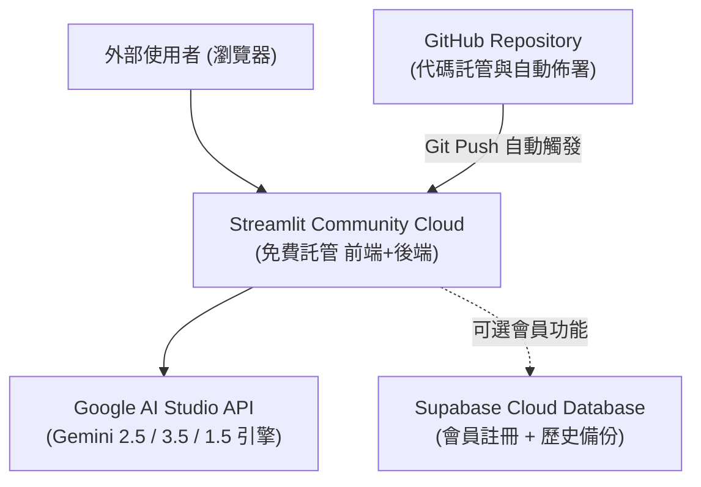

# ✨ 咒語魔法書 2.0：小白無痛複製製作與部署手冊
> **專為「技術小白」量身打造的 Step-by-Step 零門檻實戰手冊**  
> 只要按照本文件步驟操作，你能在 **15 分鐘內** 完整複製、製作並上線屬於自己的《咒語魔法書 2.0》！

---

## 📖 目錄
1. [系統架構全景圖](#1-系統架構全景圖)
2. [事前準備（三大免費工具帳號）](#2-事前準備三大免費工具帳號)
3. [步驟一：建立 GitHub 專案倉庫](#步驟一建立-github-專案倉庫)
4. [步驟二：放入核心原始碼](#步驟二放入核心原始碼)
5. [步驟三：一鍵部署至 Streamlit Community Cloud](#步驟三一鍵部署至-streamlit-community-cloud)
6. [步驟四：取得與設定 Google Gemini API Key（魔力來源）](#步驟四取得與設定-google-gemini-api-key魔力來源)
7. [步驟五（選配）：啟用 Supabase 雲端魔法迴廊（SaaS 會員資料庫）](#步驟五選配啟用-supabase-雲端魔法迴廊saas-會員資料庫)
8. [步驟六：驗證與日常維護技巧](#步驟六驗證與日常維護技巧)
9. [常見問題與除錯指南 (FAQ)](#常見問題與除錯指南-faq)

---

## 1. 系統架構全景圖

《咒語魔法書 2.0》採用現代最流行的 **輕量化無伺服器 (Serverless) 架構**：



- **代碼庫**：GitHub（免費）
- **伺服器與前端託管**：Streamlit Community Cloud（免伺服器費、自帶 HTTPS 網址）
- **AI 算力**：Google Gemini API（使用者自備 Key，BYOK 免費額度充足）
- **資料庫（選配）**：Supabase（免費雲端 PostgreSQL）

---

## 2. 事前準備（三大免費工具帳號）

請先註冊好以下三個服務的免費帳號：
1. **GitHub 帳號**：[https://github.com](https://github.com)（放程式碼）
2. **Streamlit Community Cloud 帳號**：[https://share.streamlit.io](https://share.streamlit.io)（用 GitHub 帳號直接登入）
3. **Google 帳號**：用於取得免費的 Google AI Studio API Key（[https://aistudio.google.com](https://aistudio.google.com)）

---

## 步驟一：建立 GitHub 專案倉庫

1. 登入 [GitHub](https://github.com)。
2. 點擊右上角 **「+」** ➡️ **「New repository」**。
3. 填寫倉庫資訊：
   - **Repository name**：`my-prompt-guidebook`（或你自訂的名稱）
   - **Visibility**：選 **Public**（Streamlit 免費版支援 Public 倉庫一鍵部署）
   - 勾選 **Add a README file**。
4. 點擊綠色按鈕 **「Create repository」**。

---

## 步驟二：放入核心原始碼

你的倉庫只需要 **2 個關鍵檔案** 即可跑起整套系統！

### 檔案 1：`requirements.txt`（宣告依賴套件）
在 GitHub 倉庫頁面，點擊 **「Add file」** ➡️ **「Create new file」**：
- 檔名輸入：`requirements.txt`
- 貼上以下內容：
```text
streamlit
google-generativeai
supabase
```
- 點擊右上角綠色按鈕 **「Commit changes...」** 送出。

---

### 檔案 2：`app.py`（主程式代碼）
在 GitHub 倉庫頁面，點擊 **「Add file」** ➡️ **「Create new file」**：
- 檔名輸入：`app.py`
- 貼上《咒語魔法書 2.0》的完整代碼（請複製專案庫中的 `app.py` 完整內容）。
- 點擊右上角綠色按鈕 **「Commit changes...」** 送出。

> [!TIP]
> 2.0 版本的 `app.py` 內建了 **四層級聯降級（Cascade Fallback）** 與 **強健型 JSON 容錯解析**，你不需要安裝複雜的環境，代碼本身已經自帶所有防禦盾牌！

---

## 步驟三：一鍵部署至 Streamlit Community Cloud

1. 前往 [Streamlit Community Cloud](https://share.streamlit.io) 並以 GitHub 帳號登入。
2. 點擊右上角藍色按鈕 **「Create app」**（或 **New app**）。
3. 填寫部署設定：
   - **Repository**：選擇你剛建的倉庫（例如 `你的帳號/my-prompt-guidebook`）。
   - **Branch**：`main`。
   - **Main file path**：`app.py`。
   - **App URL**（自訂網址）：可以輸入自訂子網域名稱，例如 `my-magic-prompt.streamlit.app`。
4. 點擊右下角 **「Deploy!」**。
5. 稍候 1~2 分鐘，你會看到氣球飄起，代表你的網站已經正式發布到全世界！

---

## 步驟四：取得與設定 Google Gemini API Key（魔力來源）

《咒語魔法書 2.0》採用 **BYOK (Bring Your Own Key)** 設計，網站本身不需要消耗你的個人額度，每個使用者輸入自己的 Key 即可使用：

1. 開啟 [Google AI Studio API Key 頁面](https://aistudio.google.com/app/apikey)。
2. 使用任何 Google 帳號登入。
3. 點擊 **「Create API key」** ➡️ 選擇或建立一個 Google Cloud Project ➡️ 點擊確認。
4. 複製開頭為 `AIzaSy...` 的金鑰字串。
5. 回到你剛部署好的 Streamlit 網站，在左側邊欄貼入該金鑰，即可開始詠唱！

---

## 步驟五（選配）：啟用 Supabase 雲端魔法迴廊（SaaS 會員資料庫）

如果你希望啟用「會員註冊 / 登入」與「歷史提示詞自動雲端備份」功能：

### 5.1 建立 Supabase 專案
1. 註冊並登入 [Supabase](https://supabase.com)。
2. 點擊 **「New project」**，設定專案名稱與資料庫密碼，區域可選 `Tokyo` 或 `Singapore`。

### 5.2 建立資料表
在 Supabase 左側選單進入 **SQL Editor**，執行以下指令：
```sql
create table if not exists prompt_history (
    id bigint generated by default as identity primary key,
    created_at timestamp with time zone default timezone('utc'::text, now()) not null,
    user_id uuid references auth.users not null,
    prompt_data jsonb not null
);

-- 開啟資料保護規則 (RLS)
alter table prompt_history enable row level security;

-- 允許使用者讀取與儲存自己的紀錄
create policy "Users can view own prompts" on prompt_history 
    for select using (auth.uid() = user_id);

create policy "Users can insert own prompts" on prompt_history 
    for insert with check (auth.uid() = user_id);
```

### 5.3 在 Streamlit 設定金鑰
1. 回到 Streamlit 儀表板，在你的 App 設定中點擊 **「Settings」** ➡️ **「Secrets」**。
2. 填入 Supabase 連線金鑰：
```toml
SUPABASE_URL = "https://你的專案ID.supabase.co"
SUPABASE_KEY = "你的anon_public_key"
```
3. 點擊 **Save**，網站會自動重新加載，SaaS 登入功能即刻生效！

> [!NOTE]
> 若你不設定 Supabase Secrets，系統會**自動切換為純 BYOK 訪客模式**，不影響任何核心提示詞轉譯功能！

---

## 步驟六：驗證與日常維護技巧

1. **熱重載更新**：日後只要在 GitHub 修改 `app.py` 並 Commit，Streamlit Cloud 會在 10 秒內自動拉取最新代碼並完成線上熱更新，完全不需要手動重啟伺服器。
2. **日誌查驗**：在 Streamlit 畫面右下角點擊 **「Manage app」**，即可展開查看即時 Console Log，若使用者遇到問題可在此直接排查。

---

## 常見問題與除錯指南 (FAQ)

### Q1：為什麼外部使用者以前會遇到 404 錯誤？
- **原因**：舊版本選單中有已除役的舊模型（如 `gemini-2.0-flash-lite`）。
- **2.0 解決方案**：2.0 版全面導入 `call_gemini_with_cascade` 四層回退鏈，就算選中的模型故障，系統會自動在背景切換至 `gemini-2.5-flash`，外部使用者絕對不會再被 404 中斷。

### Q2：使用者的 API Key 複製時常常帶有空格怎麼辦？
- **2.0 解決方案**：代碼內建 `api_key = raw_api_key.strip()`，自動清洗頭尾空格與換行字元。

### Q3：部署時出現 ModuleNotFoundError？
- **原因**：`requirements.txt` 檔案漏掉或拼錯。
- **解決方案**：請確認 `requirements.txt` 與 `app.py` 位於 GitHub 倉庫的最根目錄，並包含 `streamlit`、`google-generativeai`、`supabase`。
